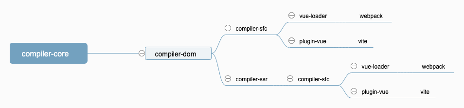

# 目录结构

在正式进入源码之前，先看一下项目的整体结构。对项目结构有一个清晰全面的了解。

首先在项目目录通过命令 `tree -L 1` 来获取最外层的目录结构。

```bash
├── BACKERS.md
├── CHANGELOG.md        // 版本更新日志
├── LICENSE
├── README.md
├── SECURITY.md
├── api-extractor.json  // TypeScript API分析和提取工具
├── jest.config.js      // jest 单元测试配置文件
├── netlify.toml
├── node_modules        // npm 包目录
├── package.json
├── packages            // 源码目录，vue3 所有源码放在这个目录下面
├── pnpm-lock.yaml
├── pnpm-workspace.yaml
├── rollup.config.js    // rollup 打包工具配置文件
├── scripts             // 命令行构建相关文件
├── test-dts            // TypeScript 类型声明文件
└── tsconfig.json       // TypeScript 配置文件
```

然后切换到 `packages` 源码目录下，执行 `tree -L 2` 命令。可以看到源码分成很多个包，每个包负责独立的功能。
```bash
├── compiler-core            // 编译核心包
│   ├── LICENSE
│   ├── README.md
│   ├── __tests__
│   ├── api-extractor.json
│   ├── dist
│   ├── index.js
│   ├── node_modules
│   ├── package.json
│   └── src
├── compiler-dom            // 编译代码 dom 相关
│   ├── LICENSE
│   ├── README.md
│   ├── __tests__
│   ├── api-extractor.json
│   ├── dist
│   ├── index.js
│   ├── node_modules
│   ├── package.json
│   └── src
├── compiler-sfc           // 编译组件相关
│   ├── LICENSE
│   ├── README.md
│   ├── __tests__
│   ├── api-extractor.json
│   ├── dist
│   ├── node_modules
│   ├── package.json
│   └── src
├── compiler-ssr          // 编译 ssr相关
│   ├── LICENSE
│   ├── README.md
│   ├── __tests__
│   ├── api-extractor.json
│   ├── dist
│   ├── node_modules
│   ├── package.json
│   └── src
├── global.d.ts
├── reactivity            // 响应式代码
│   ├── LICENSE
│   ├── README.md
│   ├── __tests__
│   ├── api-extractor.json
│   ├── dist
│   ├── index.js
│   ├── node_modules
│   ├── package.json
│   └── src
├── reactivity-transform  // 编译器转换，以改善使用VUE的反应性API时，特别是能够使用Refs，而无需任何值。
│   ├── README.md
│   ├── __tests__
│   ├── api-extractor.json
│   ├── dist
│   ├── node_modules
│   ├── package.json
│   └── src
├── runtime-core         // 远行时核心源码
│   ├── LICENSE
│   ├── README.md
│   ├── __tests__
│   ├── api-extractor.json
│   ├── dist
│   ├── index.js
│   ├── node_modules
│   ├── package.json
│   ├── src
│   └── types
├── runtime-dom         // 运行时 dom 相关
│   ├── LICENSE
│   ├── README.md
│   ├── __tests__
│   ├── api-extractor.json
│   ├── dist
│   ├── index.js
│   ├── node_modules
│   ├── package.json
│   ├── src
│   └── types
├── runtime-test       // 运行时测试相关
│   ├── LICENSE
│   ├── README.md
│   ├── __tests__
│   ├── api-extractor.json
│   ├── index.js
│   ├── node_modules
│   ├── package.json
│   └── src
├── server-renderer    // 服务端渲染
│   ├── LICENSE
│   ├── README.md
│   ├── __tests__
│   ├── api-extractor.json
│   ├── dist
│   ├── index.js
│   ├── node_modules
│   ├── package.json
│   └── src
├── sfc-playground     // sfc 相关
│   ├── index.html
│   ├── node_modules
│   ├── package.json
│   ├── public
│   ├── src
│   └── vite.config.ts
├── shared             // 工具库
│   ├── LICENSE
│   ├── README.md
│   ├── __tests__
│   ├── api-extractor.json
│   ├── dist
│   ├── index.js
│   ├── package.json
│   └── src
├── size-check
│   ├── README.md
│   ├── brotli.js
│   ├── package.json
│   ├── src
│   └── vite.config.js
├── template-explorer
│   ├── README.md
│   ├── index.html
│   ├── local.html
│   ├── node_modules
│   ├── package.json
│   ├── src
│   └── style.css
├── vue               // 开发调试相关
│   ├── LICENSE
│   ├── README.md
│   ├── __tests__
│   ├── api-extractor.json
│   ├── compiler-sfc
│   ├── dist
│   ├── examples
│   ├── index.js
│   ├── index.mjs
│   ├── macros-global.d.ts
│   ├── macros.d.ts
│   ├── node_modules
│   ├── package.json
│   ├── ref-macros.d.ts
│   ├── server-renderer
│   └── src
└── vue-compat         // 是 Vue3 的一个构建，提供了可配置的 Vue2 兼容行为
    ├── LICENSE
    ├── README.md
    ├── __tests__
    ├── dist
    ├── index.js
    ├── package.json
    └── src
```

## 编译
有四个跟编译相关的包。分别是 `compiler-core`， `compiler-dom`， `compiler-sfc` 和 `compiler-ssr`。
* **compiler-core** 核心编译包，会将组件代码编译成 ast 树，再生成运行时代码。
* **compiler-dom** 解析 html 模版代码，v-model，v-on，style 等。
* **compiler-ssr** 将 server 端代码编译成字符串，优化 server 运行性能。
* **compiler-sfc** 编译 `.vue` 组件，将 vue 模版文件代码编译成可运行的 js 代码。

它们的引用关系如下：



## 运行
组件代码实际运行相关的包。

* **runtime-core** 核心运行包，组件的初始化，更新，卸载，diff 算法等。
* **runtime-dom** dom 相关操作代码，dom 的创建，更新，卸载，事件监听等。
* **runtime-test** vue 自己的测试包，性能比 jsdom 更优。
* **server-renderer** ssr 将 vue 代码通过 renderToString 渲染成 html 字符串返回给浏览器运行。

## 响应式

* **reactivity** 响应式代码，将组件 data 添加 proxy 监控。