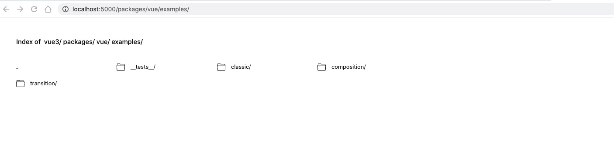

# 源码调试
调试对于学习框架代码来说是一项非常重要的技能，掌握了调试的技巧就是成功的一半。它可以让你在阅读源码过程中产生的疑惑，轻松的解决。现在让我们开始了解如何调试 vue3 源码吧。

## 获取源码

从 github 拉取代码

```bash
git clone https://github.com/vuejs/core.git vue3
```

## 安装依赖

vue3 项目环境要求 Nodejs 版本 `>=14.19`，并使用 [pnpm](https://pnpm.io/zh/installation) 安装依赖。
```bash
cd vue3

pnpm install
```

## 启动服务
启动服务需要打开两个终端窗口，分别运行两个命令。

1. 运行 dev 命令，监控源码变动并实时更新 vue 目录下的 dist 文件。
```bash
pnpm run dev
```

2. 运行 serve 命令，可以在浏览器访问 vue 目录下面的 examples 文件。
```bash
pnpm run serve
```
在浏览其中输入 `http://localhost:5000/packages/vue/examples/`，可以看到如下页面。



然后任意点击 classic，composition 或 transition 目录下的一个 html 文件，打开页面。这里我们点击 classic 目录下的 grid.html 文件。可以看到如下页面：


## 开始调试
页面打开时候，接下来就可以开始调试源码了。你可以在源码的任何一个地方做一些改变，然后点击保存，然后刷新页面，这时就可以看到自己所做的变更了。

这里我们在 `packages/reactivity/src/reactive.ts` 文件的 reactive 方法里面添加一个 console.log 打印出 target 信息。

```javascript
export function reactive<T extends object>(target: T): UnwrapNestedRefs<T>
export function reactive(target: object) {
  // if trying to observe a readonly proxy, return the readonly version.
  if (isReadonly(target)) {
    return target
  }
    
  // 打印 target 信息
  console.log('target', target)

  return createReactiveObject(
    target,
    false,
    mutableHandlers,
    mutableCollectionHandlers,
    reactiveMap
  )
}
```

然后返回页面刷新，这时在调试界面就可以看到打印的 target 信息了。

