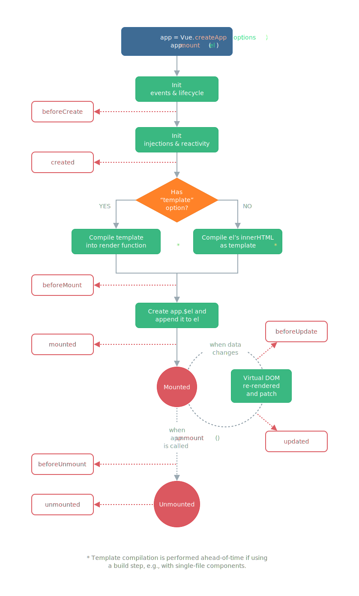

# 生命周期

下图是组件完整的生命周期。


## 注册
[传送门](https://github.com/vuejs/core/blob/3538f17a07d586a363cffa00af7cd220aff79710/packages/runtime-core/src/apiLifecycle.ts#L73)
```typescript
import {
  ComponentInternalInstance,
  currentInstance,
  isInSSRComponentSetup,
  LifecycleHooks,
  setCurrentInstance,
  unsetCurrentInstance
} from './component'
import { ComponentPublicInstance } from './componentPublicInstance'
import { callWithAsyncErrorHandling, ErrorTypeStrings } from './errorHandling'
import { warn } from './warning'
import { toHandlerKey } from '@vue/shared'
import { DebuggerEvent, pauseTracking, resetTracking } from '@vue/reactivity'

export { onActivated, onDeactivated } from './components/KeepAlive'

export function injectHook(
  type: LifecycleHooks,
  hook: Function & { __weh?: Function },
  target: ComponentInternalInstance | null = currentInstance,
  prepend: boolean = false
): Function | undefined {
  if (target) {
    const hooks = target[type] || (target[type] = [])
    // cache the error handling wrapper for injected hooks so the same hook
    // can be properly deduped by the scheduler. "__weh" stands for "with error
    // handling".
    const wrappedHook =
      hook.__weh ||
      (hook.__weh = (...args: unknown[]) => {
        if (target.isUnmounted) {
          return
        }
        // disable tracking inside all lifecycle hooks
        // since they can potentially be called inside effects.
        pauseTracking()
        // Set currentInstance during hook invocation.
        // This assumes the hook does not synchronously trigger other hooks, which
        // can only be false when the user does something really funky.
        setCurrentInstance(target)
        const res = callWithAsyncErrorHandling(hook, target, type, args)
        unsetCurrentInstance()
        resetTracking()
        return res
      })
    if (prepend) {
      hooks.unshift(wrappedHook)
    } else {
      hooks.push(wrappedHook)
    }
    return wrappedHook
  } else if (__DEV__) {
    const apiName = toHandlerKey(ErrorTypeStrings[type].replace(/ hook$/, ''))
    warn(
      `${apiName} is called when there is no active component instance to be ` +
        `associated with. ` +
        `Lifecycle injection APIs can only be used during execution of setup().` +
        (__FEATURE_SUSPENSE__
          ? ` If you are using async setup(), make sure to register lifecycle ` +
            `hooks before the first await statement.`
          : ``)
    )
  }
}

export const createHook =
  <T extends Function = () => any>(lifecycle: LifecycleHooks) =>
  (hook: T, target: ComponentInternalInstance | null = currentInstance) =>
    // post-create lifecycle registrations are noops during SSR (except for serverPrefetch)
    (!isInSSRComponentSetup || lifecycle === LifecycleHooks.SERVER_PREFETCH) &&
    injectHook(lifecycle, hook, target)

export const onBeforeMount = createHook(LifecycleHooks.BEFORE_MOUNT)
export const onMounted = createHook(LifecycleHooks.MOUNTED)
export const onBeforeUpdate = createHook(LifecycleHooks.BEFORE_UPDATE)
export const onUpdated = createHook(LifecycleHooks.UPDATED)
export const onBeforeUnmount = createHook(LifecycleHooks.BEFORE_UNMOUNT)
export const onUnmounted = createHook(LifecycleHooks.UNMOUNTED)
export const onServerPrefetch = createHook(LifecycleHooks.SERVER_PREFETCH)

export type DebuggerHook = (e: DebuggerEvent) => void
export const onRenderTriggered = createHook<DebuggerHook>(
  LifecycleHooks.RENDER_TRIGGERED
)
export const onRenderTracked = createHook<DebuggerHook>(
  LifecycleHooks.RENDER_TRACKED
)

export type ErrorCapturedHook<TError = unknown> = (
  err: TError,
  instance: ComponentPublicInstance | null,
  info: string
) => boolean | void

export function onErrorCaptured<TError = Error>(
  hook: ErrorCapturedHook<TError>,
  target: ComponentInternalInstance | null = currentInstance
) {
  injectHook(LifecycleHooks.ERROR_CAPTURED, hook, target)
}

```
生命钩子主要调用这里的 on 方法注册相应的生命钩子，这些方法主要会把用户传的方法注册到组件实例对应的属性中，如下
```typescript
export const enum LifecycleHooks {
  BEFORE_CREATE = 'bc',
  CREATED = 'c',
  BEFORE_MOUNT = 'bm',
  MOUNTED = 'm',
  BEFORE_UPDATE = 'bu',
  UPDATED = 'u',
  BEFORE_UNMOUNT = 'bum',
  UNMOUNTED = 'um',
  DEACTIVATED = 'da',
  ACTIVATED = 'a',
  RENDER_TRIGGERED = 'rtg',
  RENDER_TRACKED = 'rtc',
  ERROR_CAPTURED = 'ec',
  SERVER_PREFETCH = 'sp'
}
```
同一个生命周期可以注册一个回调，也可以注册多个回调。setup 组件由用户主动调用 on 方法进行注册，配置式组件 vue 框架会在组件初始化时调用。
