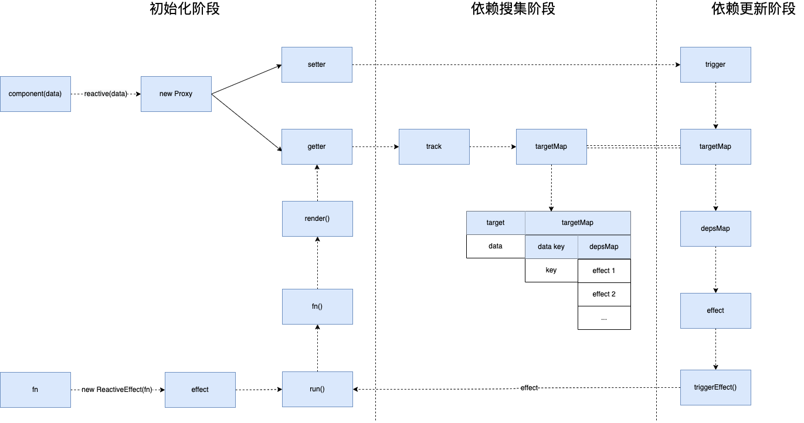

# effect

effect 也叫副作用。在 vue 组件中占据着非常重要的作用。effect 的执行过程大概有三个阶段：初始化阶段，依赖搜集阶段和依赖更新阶段。如下图所示：


## 初始化阶段
初始化阶段主要做两件事。一个是初始化组件的数据，比如 data，computed，watch等。调用reactive，computed，watch方法将这些数据添加监控。具体在第二章可以看到，这里不再讲解。另一个是初始化 effect。

[传送门](https://github.com/vuejs/core/blob/bdffc143ef3aa27c347b22f19d0052194b54836e/packages/runtime-core/src/renderer.ts#L1190)
```typescript
 const mountComponent: MountComponentFn = (
    initialVNode,
    container,
    anchor,
    parentComponent,
    parentSuspense,
    isSVG,
    optimized
  ) => {
    
    ...
    
    if (!(__COMPAT__ && compatMountInstance)) {
      if (__DEV__) {
        startMeasure(instance, `init`)
      }
      // 组件初始化
      setupComponent(instance)
      if (__DEV__) {
        endMeasure(instance, `init`)
      }
    }

    ...
    
    setupRenderEffect(
      instance,
      initialVNode,
      container,
      anchor,
      parentSuspense,
      isSVG,
      optimized
    )

    if (__DEV__) {
      popWarningContext()
      endMeasure(instance, `mount`)
    }
  }
```
在 patch 到节点是组件时，调用 mountComponent 方法开始初始化。调用 setupComponent 方法初始化数据完成之后，调用 setupRenderEffect 方法初始化 effect。

### trigger
[传送门](https://github.com/vuejs/core/blob/bdffc143ef3aa27c347b22f19d0052194b54836e/packages/runtime-core/src/renderer.ts#L1300)
```typescript
  const setupRenderEffect: SetupRenderEffectFn = (
    instance,
    initialVNode,
    container,
    anchor,
    parentSuspense,
    isSVG,
    optimized
  ) => {
    // effect 回调
    const componentUpdateFn = () => {
      // 第一次执行
      if (!instance.isMounted) {
        let vnodeHook: VNodeHook | null | undefined
        const { el, props } = initialVNode
        const { bm, m, parent } = instance
        const isAsyncWrapperVNode = isAsyncWrapper(initialVNode)

        toggleRecurse(instance, false)
        // 调用 beforeMount 生命周期方法
        if (bm) {
          invokeArrayFns(bm)
        }
        // onVnodeBeforeMount
        if (
          !isAsyncWrapperVNode &&
          (vnodeHook = props && props.onVnodeBeforeMount)
        ) {
          invokeVNodeHook(vnodeHook, parent, initialVNode)
        }
        if (
          __COMPAT__ &&
          isCompatEnabled(DeprecationTypes.INSTANCE_EVENT_HOOKS, instance)
        ) {
          instance.emit('hook:beforeMount')
        }
        toggleRecurse(instance, true)
        
        // 服务端渲染
        if (el && hydrateNode) {
          // vnode has adopted host node - perform hydration instead of mount.
          const hydrateSubTree = () => {
            if (__DEV__) {
              startMeasure(instance, `render`)
            }
            instance.subTree = renderComponentRoot(instance)
            if (__DEV__) {
              endMeasure(instance, `render`)
            }
            if (__DEV__) {
              startMeasure(instance, `hydrate`)
            }
            hydrateNode!(
              el as Node,
              instance.subTree,
              instance,
              parentSuspense,
              null
            )
            if (__DEV__) {
              endMeasure(instance, `hydrate`)
            }
          }

          if (isAsyncWrapperVNode) {
            ;(initialVNode.type as ComponentOptions).__asyncLoader!().then(
              // note: we are moving the render call into an async callback,
              // which means it won't track dependencies - but it's ok because
              // a server-rendered async wrapper is already in resolved state
              // and it will never need to change.
              () => !instance.isUnmounted && hydrateSubTree()
            )
          } else {
            hydrateSubTree()
          }

        // 客户端渲染
        } else {
          if (__DEV__) {
            startMeasure(instance, `render`)
          }
          // renderComponentRoot 方法执行组件 render 并返回组件虚拟dom树
          const subTree = (instance.subTree = renderComponentRoot(instance))
          if (__DEV__) {
            endMeasure(instance, `render`)
          }
          if (__DEV__) {
            startMeasure(instance, `patch`)
          }
          
          // diff 子树
          // 初次渲染，旧树为 null
          patch(
            null,
            subTree,
            container,
            anchor,
            instance,
            parentSuspense,
            isSVG
          )
          if (__DEV__) {
            endMeasure(instance, `patch`)
          }
          initialVNode.el = subTree.el
        }
        // 执行 mounted 生命周期
        if (m) {
          queuePostRenderEffect(m, parentSuspense)
        }
        // onVnodeMounted
        if (
          !isAsyncWrapperVNode &&
          (vnodeHook = props && props.onVnodeMounted)
        ) {
          const scopedInitialVNode = initialVNode
          queuePostRenderEffect(
            () => invokeVNodeHook(vnodeHook!, parent, scopedInitialVNode),
            parentSuspense
          )
        }
        if (
          __COMPAT__ &&
          isCompatEnabled(DeprecationTypes.INSTANCE_EVENT_HOOKS, instance)
        ) {
          queuePostRenderEffect(
            () => instance.emit('hook:mounted'),
            parentSuspense
          )
        }

        // activated hook for keep-alive roots.
        // #1742 activated hook must be accessed after first render
        // since the hook may be injected by a child keep-alive
        if (initialVNode.shapeFlag & ShapeFlags.COMPONENT_SHOULD_KEEP_ALIVE) {
          instance.a && queuePostRenderEffect(instance.a, parentSuspense)
          if (
            __COMPAT__ &&
            isCompatEnabled(DeprecationTypes.INSTANCE_EVENT_HOOKS, instance)
          ) {
            queuePostRenderEffect(
              () => instance.emit('hook:activated'),
              parentSuspense
            )
          }
        }
        
        // 标记为已挂载，触发依赖更新时，直接走 updateComponent
        instance.isMounted = true

        if (__DEV__ || __FEATURE_PROD_DEVTOOLS__) {
          devtoolsComponentAdded(instance)
        }

        // #2458: deference mount-only object parameters to prevent memleaks
        initialVNode = container = anchor = null as any
      } else {
        // updateComponent
        // This is triggered by mutation of component's own state (next: null)
        // OR parent calling processComponent (next: VNode)
        let { next, bu, u, parent, vnode } = instance
        let originNext = next
        let vnodeHook: VNodeHook | null | undefined
        if (__DEV__) {
          pushWarningContext(next || instance.vnode)
        }

        // Disallow component effect recursion during pre-lifecycle hooks.
        toggleRecurse(instance, false)
        // 有 next 说明是非组件自身状态变更导致更新
        if (next) {
          next.el = vnode.el
          // 更新组件 props，slot 等信息
          updateComponentPreRender(instance, next, optimized)
        } else {
          next = vnode
        }

        // beforeUpdate 生命周期
        if (bu) {
          invokeArrayFns(bu)
        }
        // onVnodeBeforeUpdate
        if ((vnodeHook = next.props && next.props.onVnodeBeforeUpdate)) {
          invokeVNodeHook(vnodeHook, parent, next, vnode)
        }
        if (
          __COMPAT__ &&
          isCompatEnabled(DeprecationTypes.INSTANCE_EVENT_HOOKS, instance)
        ) {
          instance.emit('hook:beforeUpdate')
        }
        toggleRecurse(instance, true)

        // render
        if (__DEV__) {
          startMeasure(instance, `render`)
        }
        // 调用组件 render 生成组件虚拟dom树
        const nextTree = renderComponentRoot(instance)
        if (__DEV__) {
          endMeasure(instance, `render`)
        }
        const prevTree = instance.subTree
        instance.subTree = nextTree

        if (__DEV__) {
          startMeasure(instance, `patch`)
        }
        
        // diff 新旧两棵树
        patch(
          prevTree,
          nextTree,
          // parent may have changed if it's in a teleport
          hostParentNode(prevTree.el!)!,
          // anchor may have changed if it's in a fragment
          getNextHostNode(prevTree),
          instance,
          parentSuspense,
          isSVG
        )
        if (__DEV__) {
          endMeasure(instance, `patch`)
        }
        next.el = nextTree.el
        if (originNext === null) {
          // self-triggered update. In case of HOC, update parent component
          // vnode el. HOC is indicated by parent instance's subTree pointing
          // to child component's vnode
          updateHOCHostEl(instance, nextTree.el)
        }
        // updated hook
        if (u) {
          queuePostRenderEffect(u, parentSuspense)
        }
        // onVnodeUpdated
        if ((vnodeHook = next.props && next.props.onVnodeUpdated)) {
          queuePostRenderEffect(
            () => invokeVNodeHook(vnodeHook!, parent, next!, vnode),
            parentSuspense
          )
        }
        if (
          __COMPAT__ &&
          isCompatEnabled(DeprecationTypes.INSTANCE_EVENT_HOOKS, instance)
        ) {
          queuePostRenderEffect(
            () => instance.emit('hook:updated'),
            parentSuspense
          )
        }

        if (__DEV__ || __FEATURE_PROD_DEVTOOLS__) {
          devtoolsComponentUpdated(instance)
        }

        if (__DEV__) {
          popWarningContext()
        }
      }
    }

    // create reactive effect for rendering
    const effect = (instance.effect = new ReactiveEffect(
      componentUpdateFn,
      () => queueJob(instance.update),
      instance.scope // track it in component's effect scope
    ))

    const update = (instance.update = effect.run.bind(effect) as SchedulerJob)
    update.id = instance.uid
    // allowRecurse
    // #1801, #2043 component render effects should allow recursive updates
    toggleRecurse(instance, true)

    if (__DEV__) {
      effect.onTrack = instance.rtc
        ? e => invokeArrayFns(instance.rtc!, e)
        : void 0
      effect.onTrigger = instance.rtg
        ? e => invokeArrayFns(instance.rtg!, e)
        : void 0
      // @ts-ignore (for scheduler)
      update.ownerInstance = instance
    }
    
    // 立即执行 update -> run -> render -> patch
    update()
  }
```
这里传入 componentUpdateFn 回调函数 new ReactiveEffect，生成 effect实例，并立即执行 effect.run 触发 componentUpdateFn 执行。

componentUpdateFn 方法中有两个部分，一个是初次渲染，一个是组件更新。

**初次渲染**

1. 执行 beforeMount 生命周期函数。
2. 调用 renderComponentRoot 方法 去执行组件的 render 函数，从而触发组件依赖搜集并获取组件的虚拟 dom 树。
3. patch 虚拟 dom 子节点，由于是初次渲染，所以旧节点为 null。新节点直接挂载。
4. 执行 mounted 生命周期函数。
5. 标记组件已渲染过 `instance.isMounted = true`，下次直接更新。

**组件更新**

1. 判断 next 非空，则说明是父组件更新引起的，调用 updateComponentPreRender 方法更新 props，slots等。
2. 执行 beforeUpdate 生命周期函数。
3. 调用 renderComponentRoot 方法 去执行组件的 render 函数，从而触发组件依赖搜集并获取组件的虚拟 dom 树。
4. patch diff 新旧两棵虚拟 dom 树。
5. 执行 updated 生命周期函数。
## 依赖搜集阶段
在组件执行 render 函数的时候，会从组件实例获取数据，从而触发监控数据的 getter 方法，在 getter 里面会执行 track 方法进行依赖搜集。依赖会保存在 targetMap 全局变量中。

### track
```typescript

export function track(target: object, type: TrackOpTypes, key: unknown) {
  // 限制是否允许 track
  // shouldTrack 限制是否可以搜集依赖，由 pauseTracking 和 resetTracking 方法切换它的值
  // activeEffect 当前 effect
  if (shouldTrack && activeEffect) {
    let depsMap = targetMap.get(target)
    // target 未被搜集过，初始化
    if (!depsMap) {
      targetMap.set(target, (depsMap = new Map()))
    }
    let dep = depsMap.get(key)
    // target key 未被搜集过， 初始化
    if (!dep) {
      depsMap.set(key, (dep = createDep()))
    }

    const eventInfo = __DEV__
      ? { effect: activeEffect, target, type, key }
      : undefined

    trackEffects(dep, eventInfo)
  }
}

export function trackEffects(
  dep: Dep,
  debuggerEventExtraInfo?: DebuggerEventExtraInfo
) {
  let shouldTrack = false
  // effectTrackDepth 正在递归 track effect 的数量
  // maxMarkerBits 
  // 比特式轨迹标记最多支持30级递归。
  // 选择这个值是为了让现代JS引擎在所有平台上使用SMI。
  // 当递归深度更大时，回落到使用完全清理。
  if (effectTrackDepth <= maxMarkerBits) {
    if (!newTracked(dep)) {
      dep.n |= trackOpBit // set newly tracked
      shouldTrack = !wasTracked(dep)
    }
  } else {
    // 使用完全清理.
    shouldTrack = !dep.has(activeEffect!)
  }

  if (shouldTrack) {
    // 搜集依赖
    dep.add(activeEffect!)
    activeEffect!.deps.push(dep)
    if (__DEV__ && activeEffect!.onTrack) {
      activeEffect!.onTrack({
        effect: activeEffect!,
        ...debuggerEventExtraInfo!
      })
    }
  }
}
```
当调用 track 方法搜集依赖时，首先查询当前 target key 是否已经被搜集过，如果没有，则搜集，否则忽略。依赖全部保存在 targetMap 全局变量中。

## 依赖更新阶段
当我们执行某个动作更新了组件数据之后，将会触发监控数据的 setter 方法。在 setter 方法中会调用 trigger 函数进行依赖更新。

[传送门](https://github.com/vuejs/core/blob/bdffc143ef3aa27c347b22f19d0052194b54836e/packages/reactivity/src/effect.ts#L259)
```typescript
export function trigger(
  target: object,
  type: TriggerOpTypes,
  key?: unknown,
  newValue?: unknown,
  oldValue?: unknown,
  oldTarget?: Map<unknown, unknown> | Set<unknown>
) {
  const depsMap = targetMap.get(target)
  // target 不存在依赖时，直接终止
  if (!depsMap) {
    // never been tracked
    return
  }

  let deps: (Dep | undefined)[] = []
  if (type === TriggerOpTypes.CLEAR) {
    // collection being cleared
    // trigger all effects for target
    deps = [...depsMap.values()]
  } else if (key === 'length' && isArray(target)) {
    depsMap.forEach((dep, key) => {
      if (key === 'length' || key >= (newValue as number)) {
        deps.push(dep)
      }
    })
  } else {
    // schedule runs for SET | ADD | DELETE
    if (key !== void 0) {
      deps.push(depsMap.get(key))
    }

    // also run for iteration key on ADD | DELETE | Map.SET
    switch (type) {
      case TriggerOpTypes.ADD:
        if (!isArray(target)) {
          deps.push(depsMap.get(ITERATE_KEY))
          if (isMap(target)) {
            deps.push(depsMap.get(MAP_KEY_ITERATE_KEY))
          }
        } else if (isIntegerKey(key)) {
          // new index added to array -> length changes
          deps.push(depsMap.get('length'))
        }
        break
      case TriggerOpTypes.DELETE:
        if (!isArray(target)) {
          deps.push(depsMap.get(ITERATE_KEY))
          if (isMap(target)) {
            deps.push(depsMap.get(MAP_KEY_ITERATE_KEY))
          }
        }
        break
      case TriggerOpTypes.SET:
        if (isMap(target)) {
          deps.push(depsMap.get(ITERATE_KEY))
        }
        break
    }
  }

  const eventInfo = __DEV__
    ? { target, type, key, newValue, oldValue, oldTarget }
    : undefined

  if (deps.length === 1) {
    if (deps[0]) {
      if (__DEV__) {
        triggerEffects(deps[0], eventInfo)
      } else {
        triggerEffects(deps[0])
      }
    }
  } else {
    const effects: ReactiveEffect[] = []
    for (const dep of deps) {
      if (dep) {
        effects.push(...dep)
      }
    }
    if (__DEV__) {
      triggerEffects(createDep(effects), eventInfo)
    } else {
      triggerEffects(createDep(effects))
    }
  }
}

export function triggerEffects(
  dep: Dep | ReactiveEffect[],
  debuggerEventExtraInfo?: DebuggerEventExtraInfo
) {
  // spread into array for stabilization
  const effects = isArray(dep) ? dep : [...dep]
  for (const effect of effects) {
    if (effect.computed) {
      triggerEffect(effect, debuggerEventExtraInfo)
    }
  }
  for (const effect of effects) {
    if (!effect.computed) {
      triggerEffect(effect, debuggerEventExtraInfo)
    }
  }
}

function triggerEffect(
  effect: ReactiveEffect,
  debuggerEventExtraInfo?: DebuggerEventExtraInfo
) {
  if (effect !== activeEffect || effect.allowRecurse) {
    if (__DEV__ && effect.onTrigger) {
      effect.onTrigger(extend({ effect }, debuggerEventExtraInfo))
    }
    if (effect.scheduler) {
      effect.scheduler()
    } else {
      effect.run()
    }
  }
}
```
当触发 trigger 方法之后，先通过 target key 从 targetMap 拿到依赖列表 deps。然后先执行所有 computed 类型的 effect 更新，然后执行非 computed 类型的 effect 更新。
